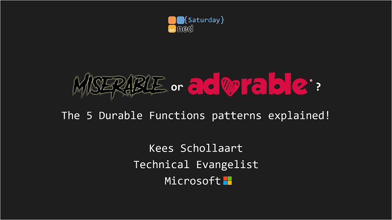

# Miserable or Adorable? Azure Durable Functions!

The demo code / companion repo of my talk:
    
*_'Miserable or Adorable? The 5 Durable Functions patterns explained!'_*

as given on https://dotnedsaturday.nl

